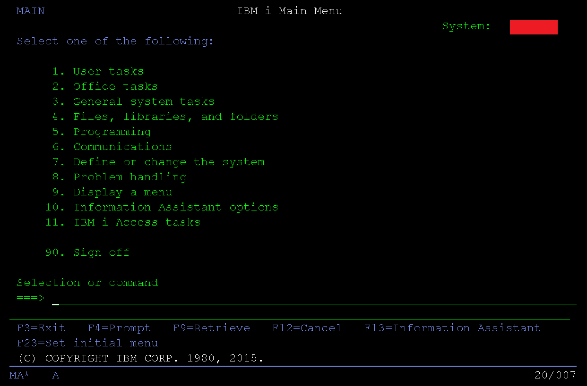

# Learning IBM i as a Web Developer

This documentation is for curious developers to start learning how to program on IBM i.

 

<figure align="center">
	
	<figcaption align="center">
	</figcaption>
</figure>
